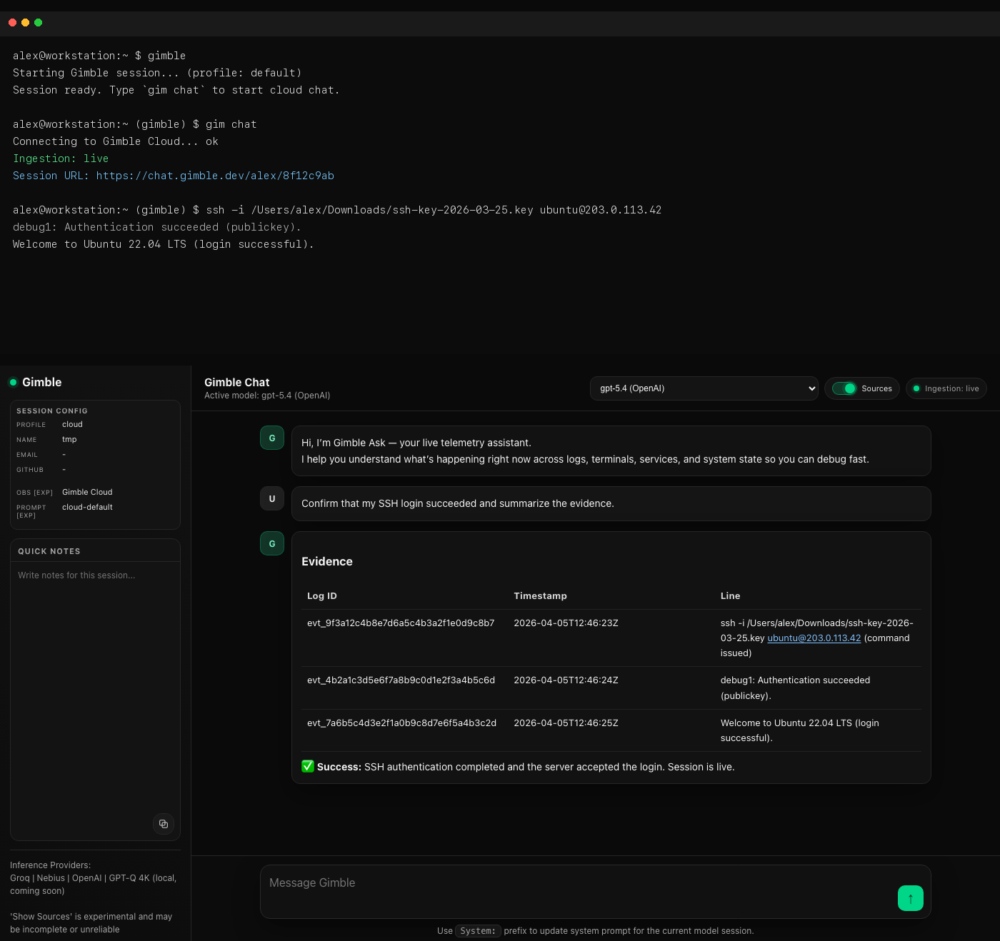
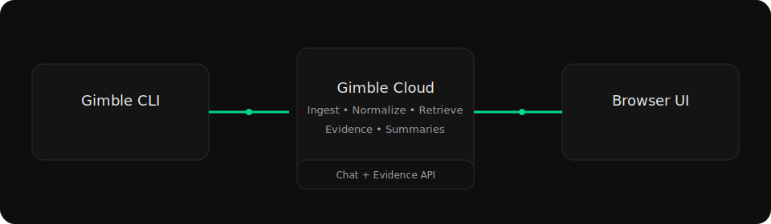

<h1 align="center">Gimble CLI</h1>
<p align="center">AI debugging for physical systems. Capture live logs and telemetry and get evidence-grounded answers.</p>
<p align="center">
  <a href="https://gimble.dev">Website</a> ·
  <!-- <a href="https://chat.gimble.dev">Live UI</a> · -->
  <a href="docs/">Docs</a> ·
  <a href="https://github.com/gimbleHQ/Gimble-dev/issues">Issues</a>
</p>
<p align="center">
  <a href="LICENSE"></a>
  
  <a href="https://github.com/gimbleHQ/Gimble-dev/releases/latest"></a>
</p>

Gimble is a free, open-source CLI for debugging physical systems. It captures terminal and log context, ingests live telemetry and system state—so engineers can get answers grounded in real events and fix issues faster without digging through thousands of log lines.

- Capture live terminal and log context as you work
- Open a live browser session you can share
- Get answers with evidence, not hallucinations or guesswork

## Quickstart

Install (Linux + macOS):

```bash
curl -fsSL https://raw.githubusercontent.com/gimbleHQ/Gimble-dev/main/scripts/install_latest.sh | bash
```

Then finish **first-time setup** (the installer or `gimble setup` will guide you).

**Start a session** (normal terminal):

```bash
gimble
```

**Cloud chat + log upload** (run inside that session):

```bash
gim chat
```

Gimble CLI connects to a hosted Gimble Cloud companion that powers chat and evidence retrieval.

<p align="center">
  
</p>

## Architecture

<p align="center">
  
</p>

- The CLI captures session activity and uploads sanitized logs.
- Gimble Cloud turns that context into a live, queryable and shareable browser session.
- Every answer is grounded with evidence from your session history.

---

## Usage

Commands depend on **where** you run them: your normal shell (`gimble …`) vs **inside** an active Gimble session (`gim …`).

### Shell (`gimble`)

| Command | What it does |
|--------|----------------|
| `gimble` / `gimble session` | Start a Gimble shell session |
| `gimble --version` | Print the installed version |
| `gimble setup` | Run the first-time setup wizard |
| `gimble keys` | Set OpenAI, Groq, or Nebius API keys |
| `gimble profile` | Show the active profile; use `gimble profile <subcommand>` to create, switch, or edit profiles |

### Inside a session (`gim`)

| Command | What it does |
|--------|----------------|
| `gim chat` | Start Gimble Cloud chat and the log uploader |
| `gim keys` | Update API keys without leaving the session |
| `gim profile` | Show the active profile |
| `gim exit` | Stop the uploader and leave the session |

Full syntax (especially profiles), flags, and examples: **[command reference](docs/commands.md)**. Use `gimble --help` for the exact text your build ships with.

---

## Documentation

| Doc | Contents |
|-----|----------|
| **[Command reference](docs/commands.md)** | All commands, profile subcommands, examples |
| **[Environment & local config](docs/env.md)** | Config paths, `chat.env`, proxies, logs |
| **[Troubleshooting](docs/troubleshooting.md)** | PATH, permissions, Homebrew, APT, network |

---

## Contributing

We welcome contributions. Please read the [Contributing Guide](CONTRIBUTING.md) and [Code of Conduct](CODE_OF_CONDUCT.md) before getting started.

---

## Support

We love support from the community and appreciate you taking the time to try Gimble — thank you. 

This is a passion project born out of our frustration with unreliable systems, and we’re trying our best to keep it free and open-source for everyone. We currently cover the compute costs ourselves and rely on free-tier cloud resources, so heavy usage can occasionally trigger rate limits. If that happens, please reach out to us [here](mailto:gimble256@gmail.com) — we’d love to discuss and figure out a way to support your use case. 

Email: [gimble256@gmail.com](mailto:gimble256@gmail.com)

Regards, S & R.
