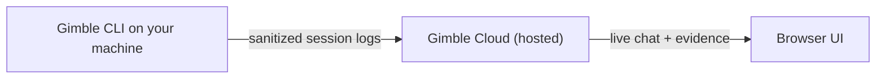

# Gimble CLI

[](LICENSE)
[](LICENSE)
[](https://github.com/Saketspradhan/Gimble-dev/releases/latest)

Gimble is a free, open-source CLI for live debugging with evidence. Capture terminal and log context, share a live browser session, and get answers grounded in the exact events that happened.
Gimble is a debugging assistant for physical systems that ingests live telemetry, ROS, terminals, and system state—helping engineers fix issues and ship faster without digging through thousands of log lines.

- Capture live terminal and log context as you work
- Open a live browser session you can share
- Get answers with evidence, not guesses

## Quickstart

Install (macOS + Linux):

```bash
curl -fsSL https://raw.githubusercontent.com/Saketspradhan/Gimble-dev/main/scripts/install_latest.sh | bash
gimble --version
gimble
gim chat
```

Open the session URL printed by `gim chat`.

Gimble CLI is open-source and connects to a hosted Gimble Cloud companion that powers chat and evidence retrieval.


## How it works



- The CLI captures session activity and uploads sanitized logs.
- Gimble Cloud turns that context into a live, shareable browser session.
- Every answer is grounded with evidence from your session history.

## Usage

Everyday commands:

- `gimble` - start a Gimble session
- `gimble setup` - run first-time setup wizard
- `gim chat` - start cloud chat and uploader (inside a session)
- `gim exit` - stop uploader and exit session

Bring your own model keys:

- `gimble keys` - set OpenAI, Groq, or Nebius API keys

Profiles (team and identity settings):

- Use `gimble profile ...` commands. See the docs for details.

## Docs

- [Command reference](docs/commands.md)
- [Examples](docs/examples.md)
- [Environment and local config](docs/env.md)
- [Troubleshooting](docs/troubleshooting.md)

## Support

If you hit an issue or have a feature request, please [open a GitHub issue](https://github.com/Saketspradhan/Gimble-dev/issues).

## License

MIT. See [LICENSE](LICENSE).
